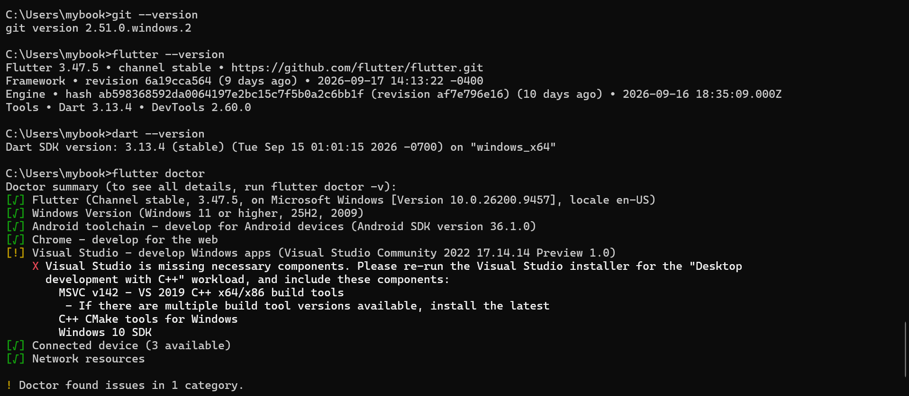
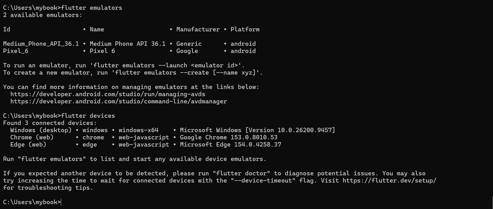

# Penjelasan Dasar-Dasar Dart

Pada latihan ini saya mencoba beberapa tipe data dan konsep dasar yang ada pada bahasa pemrograman Dart. Berikut adalah kode yang saya gunakan:

```dart
void main() { 
  String NamaLengkap = "Agit elhan"; 
  int Umur = 19; 
  int Nilai = 92; 
   
  Umur = 20; 
   
  final String studentName = 'Agit'; 
  final DateTime registrationTime = DateTime.now(); 
 
  List<String> namaMahasiswa = [ 
    'Agit', 
    'Rido', 
    'Andi', 
  ]; 
   
  Set<String> kategori = { 
    'Handphone', 
    'Laptop', 
    'Handphone', 
    'Earphone', 
  }; 
   
  Map<String, dynamic> Mahasiswa = { 
    'nama' : 'Agit', 
    'umur' : '20', 
    'aktif': true, 
  }; 
   
  Object data = 'Sheyla'; 
  data = 20; 
  data = true; 
   
  if (data is String) { 
    print(data.toUpperCase()); 
  } else { 
    print('salahhh'); 
  } 
   
  print(Mahasiswa['nama']); 
  print(Mahasiswa['umur'] + ' tahun'); 
 
  print(kategori); 
  print(NamaLengkap.toUpperCase()); 
  print(NamaLengkap); 
  print(Umur); 
  print(namaMahasiswa); 
}
```

## 1. String

```dart
String NamaLengkap = "Agit elhan";
```

`String` digunakan untuk menyimpan data berupa teks atau tulisan. Pada kode tersebut, saya membuat variabel `NamaLengkap` dan mengisinya dengan nama `"Agit elhan"`.

## 2. Integer (`int`)

```dart
int Umur = 19;
int Nilai = 92;
```

`int` digunakan untuk menyimpan bilangan bulat. Pada contoh ini digunakan untuk menyimpan umur dan nilai.

Kemudian nilai `Umur` saya ubah:

```dart
Umur = 20;
```

Karena variabel tersebut dibuat menggunakan `int` biasa, nilainya masih bisa diubah.

## 3. Final

```dart
final String studentName = 'Agit';
final DateTime registrationTime = DateTime.now();
```

`final` digunakan ketika sebuah variabel hanya ingin diberikan nilai satu kali. Setelah mendapatkan nilai, variabel tersebut tidak bisa diberikan nilai baru.

`DateTime.now()` digunakan untuk mendapatkan tanggal dan waktu saat program dijalankan.

## 4. List

```dart
List<String> namaMahasiswa = [
  'Agit',
  'Rido',
  'Andi',
];
```

`List` digunakan untuk menyimpan beberapa data dalam satu variabel dan datanya memiliki urutan.

Pada contoh tersebut, saya membuat list yang berisi beberapa nama mahasiswa.

## 5. Set

```dart
Set<String> kategori = {
  'Handphone',
  'Laptop',
  'Handphone',
  'Earphone',
};
```

`Set` digunakan untuk menyimpan kumpulan data yang tidak memiliki duplikasi.

Walaupun `"Handphone"` ditulis sebanyak dua kali, ketika ditampilkan hasilnya hanya akan terdapat satu `"Handphone"` karena `Set` tidak menyimpan data yang sama secara berulang.

## 6. Map

```dart
Map<String, dynamic> Mahasiswa = {
  'nama': 'Agit',
  'umur': '20',
  'aktif': true,
};
```

`Map` digunakan untuk menyimpan data dalam bentuk **key dan value**.

Contohnya:

* `nama` → `Agit`
* `umur` → `20`
* `aktif` → `true`

`dynamic` digunakan karena value di dalam Map dapat memiliki tipe data yang berbeda, seperti `String` dan `bool`.

Untuk mengambil data berdasarkan key, saya menggunakan:

```dart
print(Mahasiswa['nama']);
```

Hasilnya adalah:

```text
Agit
```

## 7. Object

```dart
Object data = 'Sheyla';

data = 20;
data = true;
```

`Object` dapat digunakan untuk menyimpan berbagai macam tipe data. Pada contoh ini, variabel `data` awalnya berisi `String`, kemudian diganti menjadi `int`, dan terakhir menjadi `bool`.

Jadi satu variabel dapat menyimpan nilai dengan tipe yang berbeda selama nilainya masih merupakan object di Dart.

## 8. Pengecekan tipe data dengan `is`

```dart
if (data is String) {
  print(data.toUpperCase());
} else {
  print('salahhh');
}
```

Bagian ini digunakan untuk mengecek apakah isi dari variabel `data` merupakan `String` atau bukan.

Karena pada kode sebelumnya nilai terakhir `data` adalah:

```dart
data = true;
```

maka kondisi `data is String` bernilai `false`, sehingga program menjalankan:

```text
salahhh
```

Kalau `data` berisi teks, maka program akan masuk ke bagian `if` dan mengubah teks menjadi huruf kapital menggunakan `toUpperCase()`.

## 9. Mengubah String menjadi huruf besar

```dart
print(NamaLengkap.toUpperCase());
```

`toUpperCase()` digunakan untuk mengubah semua huruf dalam sebuah `String` menjadi huruf kapital.

Contohnya:

```text
AGIT ELHAN
```

Sedangkan:

```dart
print(NamaLengkap);
```

akan menampilkan nilai aslinya:

```text
Agit elhan
```

## 10. Menampilkan isi List dan Set

```dart
print(kategori);
print(namaMahasiswa);
```

`print()` digunakan untuk menampilkan data ke terminal.

`print(kategori)` akan menampilkan isi dari `Set`, sedangkan `print(namaMahasiswa)` akan menampilkan seluruh data yang ada di dalam `List`.

## 11. Mengambil data dari Map

```dart
print(Mahasiswa['nama']);
print(Mahasiswa['umur'] + ' tahun');
```

Kode tersebut digunakan untuk mengambil nilai tertentu dari `Map` berdasarkan key-nya.

Hasilnya kurang lebih:

```text
Agit
20 tahun
```

Pada bagian ini, value `umur` dibuat sebagai `String`, yaitu `'20'`, sehingga bisa langsung digabungkan dengan teks `' tahun'`.
# Validasi Environment Flutter

Setelah melakukan latihan dasar Dart, saya melakukan validasi environment Flutter untuk memastikan tools yang dibutuhkan sudah terpasang dan dapat digunakan.

## Perintah yang Digunakan

Perintah yang digunakan untuk melakukan validasi environment:

```bash
git --version
flutter --version
dart --version
flutter doctor
flutter emulators
flutter devices
```

## Hasil Versi Tools

Hasil pengecekan versi Git, Flutter, dan Dart:



Hasil yang diperoleh:

```text
git version 2.51.0.windows.2

Flutter 3.47.5
Dart 3.13.4
DevTools 2.60.0
```

Flutter yang digunakan berada pada **channel stable**.

## Hasil Flutter Doctor

Dari hasil `flutter doctor`, beberapa komponen utama berhasil terdeteksi:

```text
[√] Flutter
[√] Windows Version
[√] Android toolchain
[√] Chrome
[√] Connected device
[√] Network resources
```

Android toolchain juga sudah tersedia dengan Android SDK versi **36.1.0**.

### Catatan Visual Studio

Pada hasil `flutter doctor` terdapat satu peringatan:

```text
[!] Visual Studio - develop Windows apps
X Visual Studio is missing necessary components.
```

Peringatan tersebut berkaitan dengan **Visual Studio Community 2022** dan kebutuhan untuk melakukan development aplikasi Flutter untuk **Windows desktop**.

Flutter meminta beberapa komponen tambahan seperti:

- Desktop development with C++
- MSVC C++ build tools
- C++ CMake tools for Windows
- Windows SDK

Namun, pada tugas ini saya berfokus pada **Flutter untuk Android**, sehingga peringatan Visual Studio tersebut tidak mengganggu Android toolchain yang sudah berhasil terdeteksi.

Perlu dibedakan antara **Visual Studio** dan **Visual Studio Code**. Visual Studio Code adalah IDE yang digunakan untuk menulis kode Flutter, sedangkan Visual Studio yang muncul pada `flutter doctor` berkaitan dengan kebutuhan development aplikasi Windows desktop.

## Emulator dan Connected Devices

Hasil `flutter emulators` menunjukkan bahwa terdapat dua emulator Android yang tersedia:



Emulator yang tersedia:

```text
Medium_Phone_API_36.1
Pixel_6
```

Keduanya dapat digunakan sebagai emulator untuk menjalankan aplikasi Flutter.

Hasil `flutter devices` menunjukkan tiga device yang terdeteksi:

```text
Windows (desktop)
Chrome (web)
Edge (web)
```

Selain itu, emulator Android sudah tersedia dan dapat dijalankan menggunakan perintah:

```bash
flutter emulators --launch <emulator_id>
```

### Catatan Visual Studio

Pada hasil `flutter doctor` terdapat satu peringatan:

```text
[!] Visual Studio - develop Windows apps
X Visual Studio is missing necessary components.
```

Peringatan tersebut berkaitan dengan **Visual Studio Community 2022** dan kebutuhan untuk melakukan development aplikasi Flutter untuk **Windows desktop**.

Flutter meminta beberapa komponen tambahan seperti:

- Desktop development with C++
- MSVC C++ build tools
- C++ CMake tools for Windows
- Windows SDK


Perlu dibedakan antara **Visual Studio** dan **Visual Studio Code**. Visual Studio Code adalah IDE yang digunakan untuk menulis kode Flutter, sedangkan Visual Studio yang muncul pada `flutter doctor` berkaitan dengan kebutuhan development aplikasi Windows desktop.

## Emulator

Hasil `flutter emulators` menunjukkan bahwa terdapat dua emulator Android yang tersedia:

```text
Medium_Phone_API_36.1
Pixel_6
```

Keduanya dapat digunakan sebagai emulator untuk menjalankan aplikasi Flutter.

## Connected Devices

Hasil `flutter devices` menunjukkan tiga device yang terdeteksi:

```text
Windows (desktop)
Chrome (web)
Edge (web)
```

Selain itu, emulator Android sudah tersedia dan dapat dijalankan menggunakan perintah:

```bash
flutter emulators --launch <emulator_id>
```

